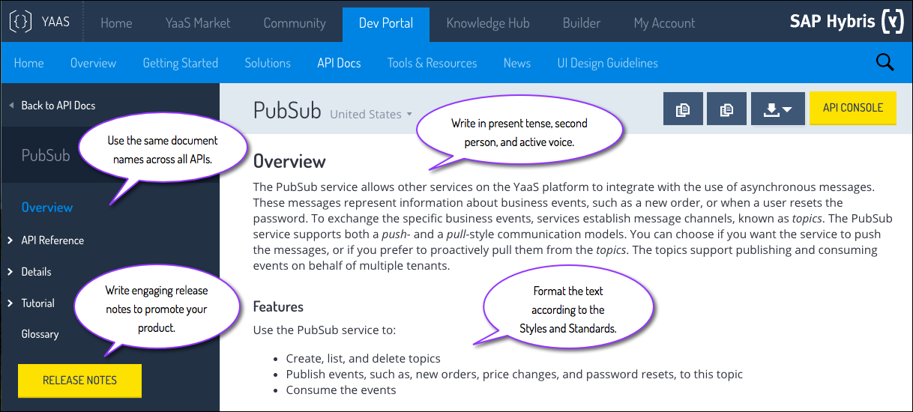

## About the Style and Standards

This guide explains the documentation requirements and provides guidelines to ensure your documentation follows the <a href="#style-and-standards">Style and Standards</a>.

It is important to follow these requirements and guidelines so that there is consistency throughout all of the documentation. The goal is to have all contributors write in the same way to ensure a uniform flow throughout the website. For example:  

These basic principals are explained in more detail in this guide, so read on for further information.

### Definition of done

The product is not done until the documentation is done. For instance, if you have a new service, feature, or solution to publish, you also need adequate documentation to release at the same time. This ensures readers fully understand the product and how to use it.

Review documentatoin before publishing to ensure the content meets the requirements and guidelines.

### Style and standards

The Style and Standards topic describes the grammar and preferred word choices, and ensures that your content meets the requirements for publication. Because this guide relies on the <a href="http://www.amazon.com/Microsoft-Manual-Style-4th-Edition/dp/0735648719">Microsoft Manual of Style - 4th Edition</a> (MMoS), this page documents only those standards that are applied differently, or that the MMoS does not address. Search this page for any term to read about the standard.

#### Grammar

[Active voice](010_About_Style_And_Standards.html.md#active-voice) | [Tenses](010_About_Style_And_Standards.html.md#tenses) | [Imperative Mood](010_About_Style_And_Standards.html.md#imperative-mood) | [Pronouns](010_About_Style_And_Standards.html.md#pronouns) | [Serial commas](010_About_Style_And_Standards.html.md#serial-commas) | [Colon vs. semicolon](010_About_Style_And_Standards.html.md#colon-vs-semicolon) | [Articles](010_About_Style_And_Standards.html.md#articles) | [Terminology](010_About_Style_And_Standards.html.md#terminology)

##### Active voice
Active voice is clear and concise, and avoids misinterpretation. It's also easier for non-native speakers to understand. Passive voice is weak and indirect, uses more words, and can lead to misinterpretation because it reverses the logical order of events. The proper order for sentence structure is subject, verb, and sometimes mentions an object. Passive voice uses object, passive verb, and sometimes the subject. Also, active voice uses the present tense of verbs which is more desirable than using past tense.

:white_check_mark: The endpoint path includes your service name. 
:no_entry: Your service name is to be included in the endpoint path.

For more information, see the [Write in Active Voice](https://github.com/YaaS/REST_API_Documentation_Guidelines/wiki/002-Write-in-Active-Voice) blog post.

##### Tenses

Use present tense. In technical writing, present tense is easier to read than past or future tense. Simple verbs are easier to read and understand than complex verbs, such as verbs in the progressive or perfect tense.

The more concise and straightforward you can be, the better.

:white_check_mark: If the information does not match, an error message appears. 
:no_entry: If the information does not match, an error will appear.

##### Imperative Mood

Use the imperative mood to write instructional documentation such as procedures and tutorials. The imperative mood tells the reader, directly, to do something. Other moods can imply optional behavior when you might not intend to present an action as optional.

For example, in instructions for uploading documents, clicking Upload is not a suggested, optional action. If the document provides instructions for how to upload documents, assume the readers wants to perform that action. Do not use language such as, "If you want to upload a document, you can click Upload" or, "By clicking Upload, you can choose how many documents you want to upload." Instead write, "Click Upload and select one or more documents."

:white_check_mark: Click **Run** to execute the program. 
:no_entry: The user should click **Run** to execute the program.

##### Pronouns

Use the second person and the pronouns "you," "your," and "yours" to speak directly to the reader. Do not use the first person pronouns "we," "us," or "let's."

:white_check_mark: You can save your files in the cloud or on your local machine. 
:no_entry: Let's save our files in the cloud or on our local machine.

##### Serial commas

Use serial commas. A missing serial comma can create confusion about whether the statement applies to each list item individually, or whether the last two items are connected.

:white_check_mark: In your request, include the values for the request date, name, and ID. 
:no_entry: In your request, include the values for the request date, name and ID.

For more details, see the [Serial Commas: The Price of Omission]( https://github.com/YaaS/REST_API_Documentation_Guidelines/wiki/004-Serial-Commas-The-Price-of-Omission) blog post.

##### Colon vs. semicolon

Use colons and semicolons sparingly. Use the colon ( : ) to introduce a list of things. The items after a colon are not complete sentences by themselves. The semicolon ( ; ) separates two distinct clauses within one sentence. The phrase after a semicolon is a complete sentence.

If the sentence needs a colon but does not need a bulleted list, consider rewriting the sentence to avoid using a colon.
If the sentence has a semicolon, try to separate it into two different sentences, or find a cleaner way to combine them into one sentence.
See the examples for ways to write the same sentence with and without a colon or semicolon. The preferred method for such a sentence is without a colon or semicolon.

:white_check_mark: Of my three brothers, John is my favorite. 
:no_entry: I have three brothers: John is my favorite. 
:no_entry: There are three brothers in the family; John is my favorite.

##### Articles

Always verify the use of the articles "a", "an", and "the" where appropriate. Use "the" when you are talking about a specific example. Use "a" when you are talking about something non-specific or hypothetical.

:white_check_mark: Use the service to remove an item from a cart. In this tutorial, create a cart item and then delete the item from the cart. 
:no_entry: Use the service to remove an item from a cart. In this tutorial, create a cart item and then delete an item from a cart.

For more information, see the [Articles in English Grammar](https://github.com/YaaS/REST_API_Documentation_Guidelines/wiki//005-Articles-in-English-Grammar) blog post.

##### Terminology
Here is some terminology that people often struggle with, and guidelines that surround each topic. Click on them for more details and examples. 

 
  
 American English spelling, not British English spelling 

	 
	

		:white_check_mark: The color of the message changes from blue to red if there are errors. 
	 	:no_entry: The colour of the message changes from blue to red if there are errors.
	

  

 
  
 "application," not "app" 

	 
	

	  	:white_check_mark: Create a new application with the name of your choice. 
	  	:no_entry: Create a new app with the name of your choice.
  	

  

 
  
 "as shown in the example," not "as shown below" 

	 
  	

	  	Don't use "above" or "below" to indicate a direction. Omit them, or use "the following" or "the preceding" if necessary.
	

	

		:white_check_mark: In your request, supply the values as shown in the example: 
		:white_check_mark: In your request, supply the values for the following parameters: 
		:no_entry: In your request, supply the values as shown below:
 	 

 

 
  
 "back end" or "back-end," not "backend" 

	 
  	

	  	Use a more specific term when possible, such as a server, operating system, database, or network. If not, use "back end" as a noun, or "back-end" as an adjective.
	

	

	  	:white_check_mark: Set up accounts in your back-end system with command line requests. 
	  	:white_check_mark: Configure the application on the back end. 
	 	 :no_entry: Configue the application on the backend.
  	

   

 
	
 "Click <strong>Add</strong>" or "Click the <strong>Add</strong> button." 

	 
  	

  		If the button has a label with text, use the label name without the word "button." If the button or icon does not have a text label, use a descriptive name with the word "button" or "icon". Use bold for the label, button, or icon name.
	

	

		:white_check_mark: Click <strong>Add</strong>. 
		:white_check_mark: Click the <strong>Maximize</strong> icon.
  	

  

 
  
 "email," not e-mail 

	 
  	

		:white_check_mark: You can send an email using the template. 
		:no_entry: You can send an e-mail using the template.
  	

 

 
  
 "fill in," not "complete" 

	 
  	

   		:white_check_mark: Fill in the remaining fields and click <strong>Save</strong>. 
		:no_entry: Complete the remaining fields and click <strong>Save</strong>.
	

  

 
  
 "ID" and "id" 

	 
  	

   		Use "ID" as the abbreviation for identification in paragraph text. "Id" or "id," is appropriate when documenting code.
	

	

		:white_check_mark: Enter your user ID in the provided field. 
		:no_entry: Enter your user id in the provided field.
  	

  

 
  
 "for example," not "i.e." 

	 
  	

		Don't use "i.e." or "e.g." in documentation, or at least use them correctly. For example, i.e. does not mean "for example. Use the words "for example" or "such as" instead. Don't use "for example" in the middle of the sentence.
	

	

		:white_check_mark: There are many variables in the file. For example, you can configure the host ID. 
		:white_check_mark: There are some variables that are inherited from the parent process, such as user ID, date, and permissions. 
		:no_entry: There are many variables in the file, for example, user ID, that can be configured.
	

  

 
  
 "key-value," not "key/value," nor "key:value" 

	 
  	

   		:white_check_mark: The Configuration service uses independent key-value pairs to store all configuration information. 
		:no_entry: The Configuration service uses independent key/value pairs to store all configuration information
  	

  

 
  
 "can," not "it is possible" 

	 
  	

		Use "can" or "cannot" instead of "it is possible" or "it is not possible."
	

	

   		:white_check_mark: You cannot enter more than eight characters. 
		:no_entry: It is not possible to enter more than eight characters.
  	

  

 
  
 "must," not "should" 

	 
  	

		Don't use "should" because it creates uncertainty. Don't use the phrase "have to" either. Use "must" only to describe something that is required, or reword it to omit it entirely.
	

	

		:white_check_mark: Your computer must have at least 128 MB of RAM to run this program. 
		:white_check_mark: Verify your computer has at least 128 MB of RAM to run this program. 
		:no_entry: Your computer should have at least 128 MB of RAM to run this program. 
		:no_entry: You have to have at least 128 MB of RAM to run this program. 
	

  

 
  
 "single sign on (SSO)," not "single sign-on" 

	 
  	

  		:white_check_mark: The platform has single sign on (SSO) to make it easier to use related applications. 
		:no_entry: The platform has single sign-on to make it easier to use related applications.
 	

  

 
  
 "section," not "topic" in cross references 

	 
  	

   		:white_check_mark: For more information about creating email templates, see the <a href="https://devportal.yaas.io/services/email/latest/">Email</a> section. 
		:no_entry: For more information about creating email templates, see the <a href="https://devportal.yaas.io/services/email/latest/">Email</a> topic.
	

  

 
  
 "typically," not "usually" 

	 
  	

   		:white_check_mark: Typically, the access is granted. 
		:no_entry: Usually, the access is granted.
  	

  

 
  
"Using," not "via" 

	 
  	

   		Don't use "via." Instead, use "through," "in," "using," "with," "by," or another appropriate term.
	

	

		:white_check_mark: You can also make the request using a command line interface. 
		:no_entry: You can also make the request via a comand line interface.
  	

#### Voice and tone

Voice and tone standards apply to the different types of documentation. First, it is important to understand the difference between voice and tone, and then follow the guidelines for writing content in the proper tone, depending on the destination for your documentation.

<h5>Difference between voice and tone</h5>

The difference between voice and tone can be a bit hard to differentiate at first. But think about the sound of your own voice, or a certain phrase that you use often. Those characteristics define your voice. When you address different people, or write documentation for different situations, you still have the same voice, but you might use a different tone. For instance, if you beat a friend in foosball, you might say, "I crushed you!" But if you beat your child at foosball, you might say, "Good game, kid."

<h5>Tones in technical documentation</h5>

There are different tones for the different types of technical documentation. The documentation can range from instructional to somewhat conversational, but always with the goal of helping users understand how to use the product for practical purposes and, in blogs and release notes, also helping business users understand changes so they can plan according to their business needs.  
[NEXT >](020_Syntax_Guidelines.html.md)
