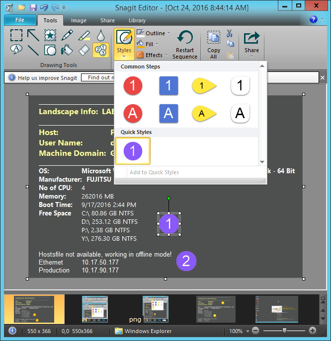
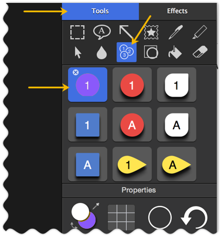
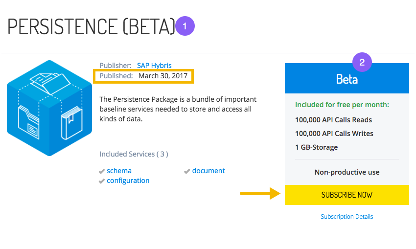

These guidelines explain the rules for using specific features, syntax, and elements in the developer documentation. For information on using the HTML or MD syntax itself, see the <a href="https://devportal.yaas.io/tools/documentationsdk/index.html#About">Syntax</a> section of the Documentation SDK.

### Content formatting
These are the guidelines for content formatting, such as when to use bullets or tables. In general, content is easier to read when it is in chunks. Consider breaking up endless paragraphs by using a list or table.

#### Ordered and unordered lists
As you write about your topic, use lists to create visual clarity within your content, listing items in a category or listing items in a sequence. Use an ordered, or numbered, list for sequential, instructional steps. Unordered lists are appropriate for list items that have no sequential order, such as a list of valid file types. Follow these guidelines for creating a list:
* Make list content consistent in structure. For example, make all the bullet points sentences, questions, or sentence fragments, but do not mix types.
* Punctuate bullet points consistently. If they are all sentences, use periods. If they are sentence fragments, do not use periods.
* Avoid ending bullet points with punctuation such as semicolons or commas.
* Capitalize the first letter of each bullet point consistently. Capitalize the first letter unless the list items are always lowercased, as with parameters names.
* Emphasize the beginning of the bullet point to capture the main idea.
* If readers must perform list items in order, as in a step-by-step procedure, use an ordered list, and maintain the consistency in structure.

#### Tables
Another effective way to chunk content is to use tables. Use them when content needs comparison, or as a way to provide information mapping. Think of a table as a list, but with optional columns to provide and organize more information than belongs in a list. Make sure tables are not too long or hard to read, causing the reader to scroll a lot. Break up a long table into multiple tables, if possible. For an example, see the <a href="#AbouttheStyleandStandards">Style and Standards</a> tables.

The YaaS documentation's Cascading Style Sheet (CSS) and other plug-ins control elements such as note panels and certain headings. These are the guidelines for using these styled elements. For information on using the HTML or MD syntax itself, see the <a href="/tools/documentationsdk/index.html#About">Syntax</a> section of the Documentation SDK.

#### Headings

Ideally, headings fit onto one line in the generated output, but balance brevity with a heading that adequately describes the main point of the document, section, or topic. Follow these guidelines when writing headings:

* Write headings within a document in sentence case. For example, **Create a product category**.
* In the Dev Portal, use present tense verbs in headings. For example, **Add a document type**.
* While gerunds are acceptable in body-level content, DO NOT use gerunds in headings, as in **Creating a storefront**.
* Avoid stacked headings, which are headings without body-level content in between. For example, DO NOT use a Heading 3 (H3) to introduce one or more H4s. Instead, add a paragraph after the H3 that describes the main idea of the content in the headings that follow.

Do not use the first and second heading levels because they are reserved in the style sheets for the following uses:
<ul>
<li>Heading 1 displays the name of a service, tool, or other main topic.</li>
<li>Heading 2 displays the title of a document or section.</li>
</ul>
This means that if you use H1 or H2 inside your documents, the heading is too large in comparison to the overall navigation and separation of sections within the documentation. Start your headings with H3, and increase the numbering from there to decrease the heading size.

#### Links

Linking is a great tool to use to incorporate a lot of content into your document with fewer words. That being said, overuse of linking can create "link rot" when links break, and if a page has more links than content, it is not very pleasing to read. Choose carefully when and how to link by using these best practices.

- Every link has the potential to go bad over time, and the more links you include, the higher the chance that one will break. If something is not central to the subject at hand, is well-known by your audience, or can be found with a simple search, there is no point in linking.
- For external links, link to the main page of the external website and then describe how to access the destination link. For example, `Go to the <a href="www.raml.org">RAML</a> website and click on the download link.` Main page URLs are less likely to change.
- Choose the link text carefully. Do not link entire phrases which become overemphatic. Instead, choose the noun, such as an article or specification within the phrase that helps the reader understand where the navigation leads them. Or use the title of the article or book as the link, but do not include the author and publisher.
- Link to web pages instead of PDFs whenever possible.
- Do not include spaces or other characters in the link that require escape characters for translation.
- Check your links often to make sure they are still operational. There are free online tools to make it easier.

##### Good examples

- For more information about mixins, see the <a href="https://devportal.yaas.io/services/document/latest/index.html#OperateonMixins">Operate on Mixins</a> topic in the Document service documentation.
- See the <a href="https://devportal.yaas.io/overview/yaasinanutshell/index.html">YaaS in a Nutshell</a> page for more information.
- The recommended reading is a book entitled <a href="http://shop.oreilly.com/product/0636920033158.do">Building Microservices</a> by Sam Newman, O'Reilly Media.

For information on using the HTML or MD linking syntax itself, see the <a href="https://devportal.yaas.io/tools/documentationsdk/index.html#About">Syntax</a> section of the Documentation SDK.

#### Images and screenshots
As someone once said, a picture is worth a thousand words. Therefore, whenever possible, use a diagram, image, or screenshot to convey a lot of information visually. Follow these guidelines when placing a diagram, screenshot, or other image in your content. For information on using the HTML or MD syntax itself, see the <a href="https://devportal.yaas.io/tools/documentationsdk/index.html#About">Syntax</a> section of the Documentation SDK.

Images and screenshots can quickly convey a lot of important information in your documentation. Do not use directional indicators, such as "above" and "below" to refer to images. Instead, include a brief introduction before each image that describes the purpose of the image and any necessary details. Do not overuse images such as including multiple screenshots of the same screen. Either condense them into one screenshot, or crop the images to show different areas. Follow the rest of these guidelines to make or use images, or capture screenshots:
 <ul>
   <li>Make or capture your images using any tool that outputs high quality images, such as <b>Snagit</b>. The desired image format is SVG (vector), but PNG and JPG (raster) are acceptable.</li>
   <li>Use an online tool such as <a href="https://tinypng.com/">TinyPNG</a> to compress images and limit the size of each image to 1MB, or smaller.
   <li>If you want to control the size of the image relative to the screen size, use one of these standard percentages: 100%, 75%, 50%, or 25%.</li>
   <li>Align images to the left, unless it is a special case, such as images in a table.</li>
   <li>Do not include the mouse pointer in your screenshots, unless it shows a function related to the content.</li>
   <li>To highlight certain areas of an image, crop the image, or use <strong>yellow</strong> (RGB: 240,171,0 or HEX: #F0AB00) for arrows or boxes around elements with a three point line width.</li>
   <li>For multiple screenshots, use your best judgment as to whether you include one introduction, or whether you introduce each screenshot separately.</li>
   <li>Describe multiple areas using <strong>purple</strong> round stamps with white numbers. In Snagit, you can create a number in this style and add it to the quick styles menu: 

    

    

    

    

  

   </li>
   <li>Introduce the image with a sentence, similar to this example:  
   See this example for the screenshot highlight, border, color, and clickable image guidelines:
    
     </li>
 </ul>

### Code formatting
 The following tables outline when to use bold font and when to use code font:

##### Use bold font for these items:
|Items|Examples|
|-----|--------|
|Parameters Events File names Path names Scopes|The **partial** attribute is optional. The service publishes a **password-reset-requested** event. Open the **pom.xml** file. Save the file in the **\services\repository\** folder. Use the **hybris.profile_graph_view** scope to view data in the graph.|

##### Use code font for these items:
|Items|Examples|
|-----|--------|
|Code examples Values Endpoints Status and error codes Parameter and value pairs|Verify the installation with the <code>mvn help:system</code> command. Set the **partial** attribute to `true` to perform a partial replacement. Send a POST request to the `/{tenant}/categories/{categoryId}/media/{mediaId}/commit` endpoint. A successful response includes a status code of `200 OK`. To perform a partial replacement, include `partial=true` in your request.|
